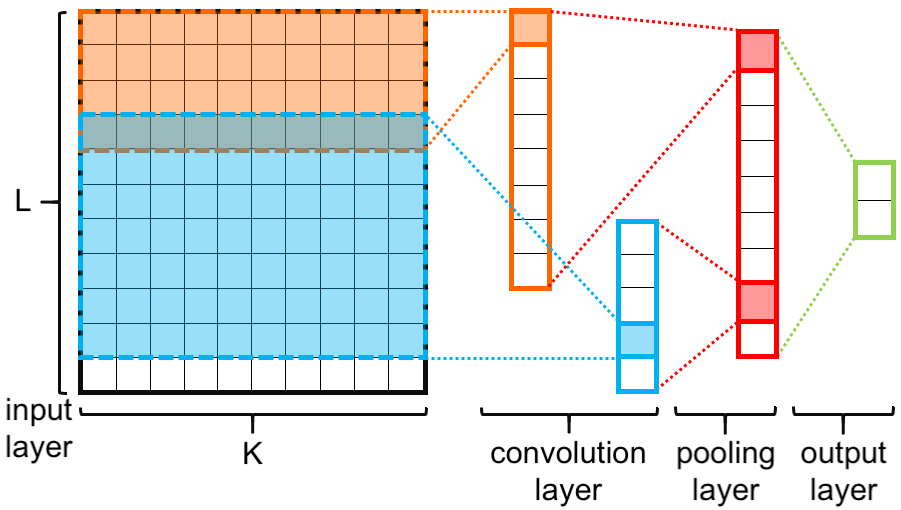

# Twitter Drug Use

We implement a CNN NLP classification method specific to judge drug use behaviors. Through the analysis of a collected set of Twitter data, a model will be developed for predicting positively referenced, drug-related tweets. From this, trends and correlations can be determined.

## Important
 I join the main algorithm design, the final algorithm and compare with others algorithm parts finished by the others team member.
 Paper Link:  Utilizing Twitter Data Analysis and Deep Learning to Identify Drug Use

## CNN_NLP Structure.
Utilizing a Word2Vec embedding approach, each word within the tweets was embedded to a fixed
length array of vectors (or a K-dimensional vector, if the length was K). The word vectors in each
tweet were then concatenated into a 2-dimensional matrix. Following this, training was performed
using a convolutional neural network (CNN) on the labeled data, which further classified another
subset of the potential drug-related tweets. This CNN architecture had several filters all of length K;
however, the heights of the filters were different. The height, in this case, represented the number of
words the filter could perceive. Since the Word2Vec approach was used, the embedding of alike
words (words having a comparable meaning) was similar. This helped the CNN care less about the
variety of words and instead focus on the semantic meaning of words and their corresponding
relationships.

The CNN architecture. L is the length limitation of each sentence; K is the dimension of
each Word2Ved embedding. Only two filters (orange and blue rectangles surrounded by dashed
lines) shown in this figure, therefore, only two feature maps shown in the convolution layer.

## Visualization of feature maps
Fixed sentence lehgth within 50 words so on feature map you can see the block parts.

## results
**The results licence from**
**Joseph Tassone, BSc; Peizhi Yan, BSc; Mackenzie Simpson, BSc; Chetan Mendhe, MSc; Vijay
Mago, PhD; Salimur Choudhury, PhD**

**Department of Computer Science, Lakehead University, Thunder Bay, Ontario, Canada**

The logistic regression and decision tree models utilized 12,142 data points for training and
1041 data points for testing. The results calculated from the logistic regression models respectively
displayed an accuracy of 54.56% and 57.44%, and an AUC of 0.58. While an improvement, the
decision tree concluded with an accuracy of 63.40% and an AUC of 0.68. All these values implied a
low predictive capability with little to no discrimination. Conversely, the CNN-based classifiers
presented a heavy improvement, between the two models tested. The first was trained with 2,661
manually labeled samples, while the other included synthetically generated tweets culminating in
12,142 samples. The accuracy scores were 76.35% and 82.31%, with an AUC of 0.90 and 0.91.
Using association rule mining in conjunction with the CNN-based classifier showed a high
likelihood for keywords such as “smoke”, “cocaine”, and “marijuana” triggering a drug-positive
classification.

